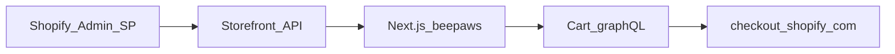

# Plan: Shopify headless — catalog Admin, web tùy chỉnh, checkout Shopify

## Mục tiêu

- **Quản trị sản phẩm** trên Shopify Admin (nguồn sự thật).
- **Site Next.js (beepaws)** đóng vai trò storefront tùy chỉnh, gọi API như client headless.
- **Thanh toán** luôn qua **Shopify Checkout** (hosted), không tự xử lý thẻ trên app.

## Kiến trúc tóm tắt

## Phân chia API (bắt buộc nắm)

| Nhu cầu | API | Ghi chú |
|--------|-----|--------|
| Đọc catalog, collection, variant (server) | **GraphQL Admin API** | `SHOPIFY_ADMIN_ACCESS_TOKEN` (server-only); scope `read_products` / collections. |
| Giỏ hàng đồng bộ trên site, checkout URL | **Storefront Cart** (`cartCreate`, lines mutations, `checkoutUrl`) | Chuẩn headless. |
| Thanh toán | **Hosted checkout** | Lấy `checkoutUrl` từ cart, redirect. |

## Hiện trạng repo (điểm neo)

| Khu vực | Vị trí | Trạng thái |
|--------|--------|------------|
| Storefront fetch | `lib/shopify/index.ts` | Ổn |
| Catalog | `lib/shopify/queries.ts`, `admin-catalog.ts` | GraphQL Admin |
| Permalink giỏ | `lib/shopify/cart-permalink.ts`, `VariantSelector` | Redirect `/cart/{id}:{qty}` — chưa Cart API |
| Checkout UI | `app/checkout/page.tsx` | Redirect tới hosted `.../cart` |
| Tài liệu cart | `docs/phase-4-cart-checkout.md` | Mục tiêu triển khai |

## Giai đoạn triển khai

### Giai đoạn 1 — Chuẩn bị cửa hàng

- [ ] Storefront API token + `NEXT_PUBLIC_SHOPIFY_STORE_DOMAIN` (`.env.example`).
- [ ] Sản phẩm trên Admin: published, đúng **sales channel** để Storefront thấy.
- [ ] `NEXT_PUBLIC_SHOPIFY_ONLINE_STORE_URL` nếu primary domain khác `myshopify.com` (permalink/cart links).

### Giai đoạn 2 — Cart Storefront API

- [ ] Route Handlers hoặc Server Actions gọi GraphQL: `cartCreate`, `cartLinesAdd` / `Update` / `Remove`, query `cart { checkoutUrl }`.
- [ ] Lưu `cartId` (cookie hoặc localStorage).
- [ ] Cart drawer / trang giỏ: subtotal từ API.
- [ ] (Tuỳ chọn) Cân nhắc bỏ `NEXT_PUBLIC` cho Storefront token — chỉ gọi từ server để hạn chế lộ token.

### Giai đoạn 3 — Checkout thật

- [ ] Checkout: đã redirect hosted cart; có thể bổ sung Cart API `checkoutUrl`.
- [ ] Copy UI: làm rõ đơn hoàn tất trên Shopify; trang “cảm ơn” tuỳ chọn sau.

### Giai đoạn 4 — Tuỳ chọn

- [ ] Webhooks Admin (`orders/create`, inventory) nếu cần đồng bộ DB — app public URL + HMAC.
- [ ] Customer accounts (Storefront Customer API) nếu cần đăng nhập headless.

## Rủi ro / giới hạn

- **Cart permalink**: đủ cho MVP nhưng không có state giỏ trên Next; UX đầy đủ cần Cart API.

## Skill cho agent

Hướng dẫn chi tiết khi chỉnh code: `.cursor/skills/shopify-headless-beepaws/SKILL.md`.
